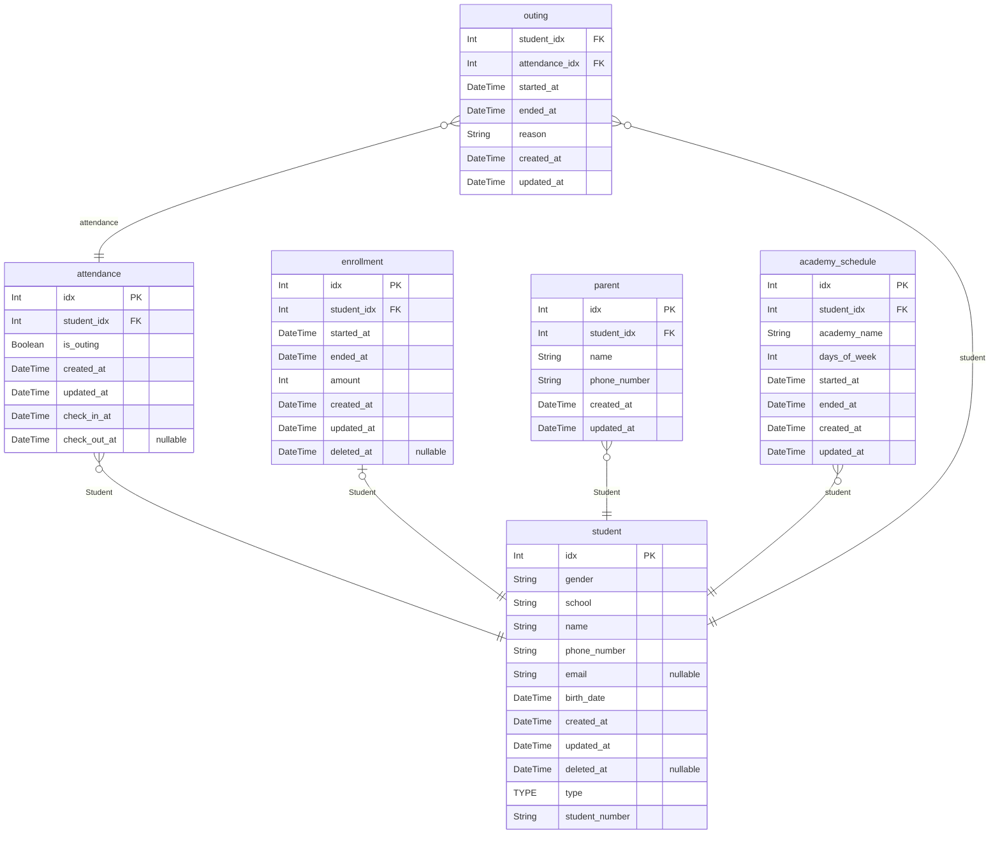

# Dudu
> Generated by [`prisma-markdown`](https://github.com/samchon/prisma-markdown)

- [default](#default)

## default

### `attendance`
This model or at least one of its fields has comments in the database, and requires an additional setup for migrations: Read more: https://pris.ly/d/database-comments

**Properties**
  - `idx`: 
  - `student_idx`: 
  - `is_outing`: 
  - `created_at`: 
  - `updated_at`: 
  - `check_in_at`: 
  - `check_out_at`: 

### `enrollment`
This model or at least one of its fields has comments in the database, and requires an additional setup for migrations: Read more: https://pris.ly/d/database-comments

**Properties**
  - `idx`: 
  - `student_idx`: 
  - `started_at`: 
  - `ended_at`: 
  - `amount`: 
  - `created_at`: 
  - `updated_at`: 
  - `deleted_at`: 

### `parent`
This model or at least one of its fields has comments in the database, and requires an additional setup for migrations: Read more: https://pris.ly/d/database-comments

**Properties**
  - `idx`: 
  - `student_idx`: 
  - `name`: 
  - `phone_number`: 
  - `created_at`: 
  - `updated_at`: 

### `student`
This model or at least one of its fields has comments in the database, and requires an additional setup for migrations: Read more: https://pris.ly/d/database-comments

**Properties**
  - `idx`: 
  - `gender`: 
  - `school`: 
  - `name`: 
  - `phone_number`: 
  - `email`: 
  - `birth_date`: 
  - `created_at`: 
  - `updated_at`: 
  - `deleted_at`: 
  - `type`: 
  - `student_number`: 

### `academy_schedule`

**Properties**
  - `idx`: 
  - `student_idx`: 
  - `academy_name`: 
  - `days_of_week`: 
  - `started_at`: 
  - `ended_at`: 
  - `created_at`: 
  - `updated_at`: 

### `outing`

**Properties**
  - `student_idx`: 
  - `attendance_idx`: 
  - `started_at`: 
  - `ended_at`: 
  - `reason`: 
  - `created_at`: 
  - `updated_at`: 